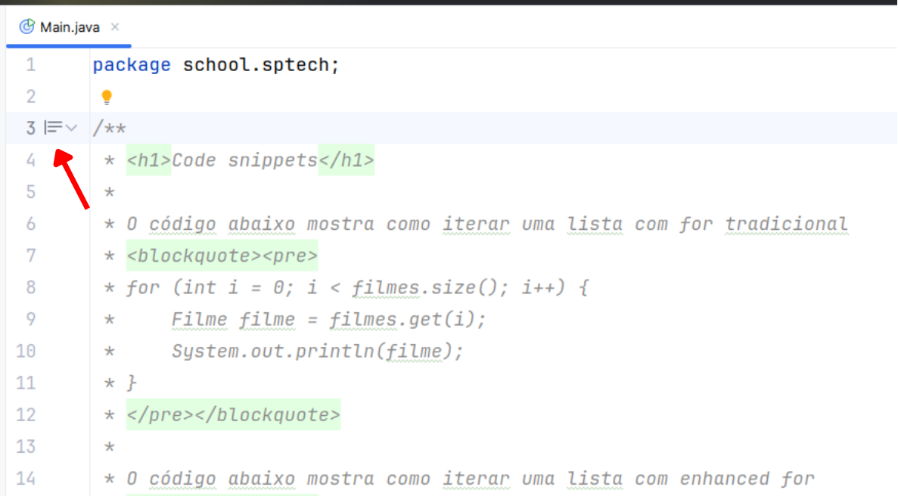
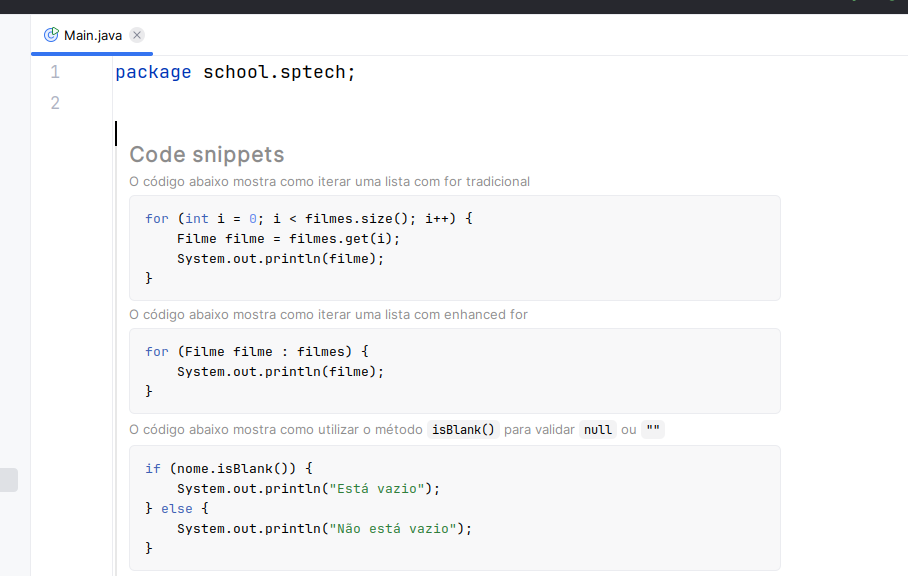
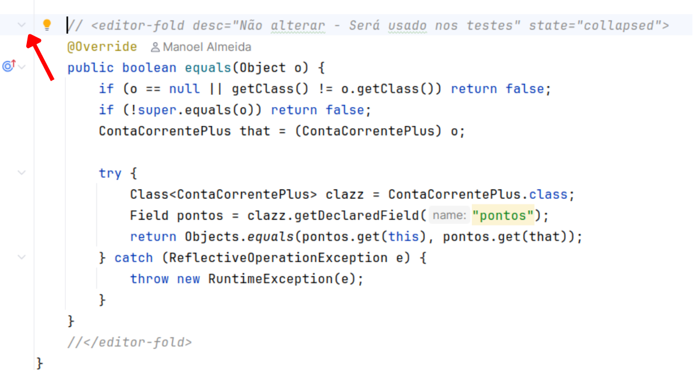
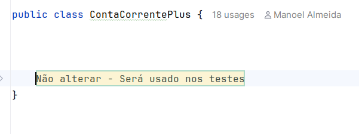
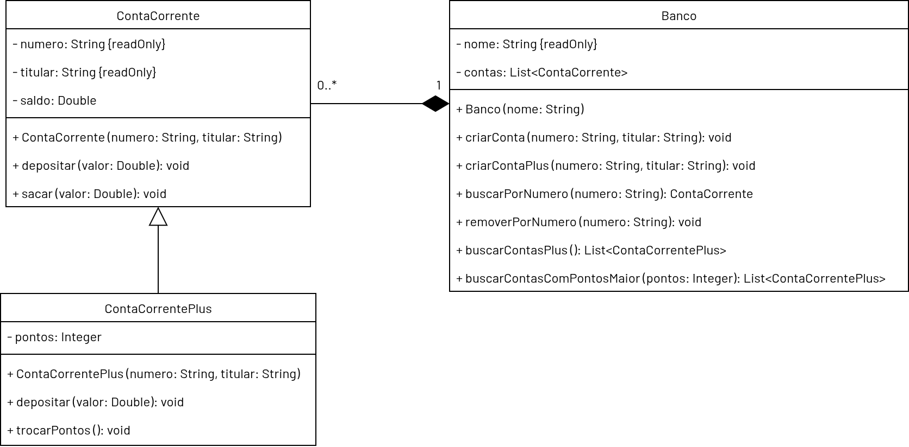

# Avaliação Continuada 02 - Prática 📎

### Orientações Gerais: 🚨

1. Utilize **apenas** tipos **wrapper** para criar atributos e métodos.
2. **Respeite** os nomes de atributos e métodos definidos no exercício.
3. Tome **cuidado** com os **argumentos** especificados no exercício.
   **Não** adicione argumentos não solicitados e mantenha a ordem definida no enunciado.
4. Verifique se **não** há **erros de compilação** no projeto antes de enviar.
5. As classes devem seguir as regras de encapsulamento.
6. Deixe um **construtor vazio** para utilização nos testes unitários.
7. **Não altere** os códigos já escritos nas classes. Eles são essenciais para os testes e não
   precisam ser modificados.

## Banco Digital

_Olá, desenvolvedor,_

_Você foi contratado para desenvolver um sistema para um banco digital gerenciar
diversas contas correntes._

_O diagrama possui também os construtores que devem ser implementados dentro
das classes correspondentes._

_A classe Main contém alguns snippets de código para ajudar em sua jornada._

> **Dica:** Utilize o IntelliJ para facilitar a visualização dos snippets.
>
> <table> 
> <tr>
> <td align="center">
> 
> </td>
> <td align="center">
> 
> </td>
> </tr>
> </table>
> <table> 
> <tr>
> <td align="center">
> 
> </td>
> <td align="center">
> 
> </td>
> </tr>
> </table>
_Boa Sorte_ 🍀

Atenção: Os atributos `{readOnly}` devem ser declarados como `final` no Java.

### Classe `ContaCorrente`

#### Construtores:

* `ContaCorrente(String numero, String titular)`
    * Inicia os atributos `numero` e `titular`.
    * Inicia o saldo com zero.

#### Métodos:

* `void depositar(Double valor)`
    * Adiciona o valor desejado ao saldo da conta corrente.
    * Não deve realizar o depósito caso o `valor` seja nulo.
    * Não deve realizar o depósito caso o `valor` seja 0 ou menor.

* `void sacar(Double valor)`
    * Retira o valor desejado ao saldo da conta corrente.
    * Não deve realizar o saque caso o `valor` seja nulo.
    * Não deve realizar o saque caso o `valor` seja 0 ou menor.
    * Não deve realizar o saque caso não haja saldo o suficiente.

* Deve conter apenas getters para todos os atributos.

### Classe `ContaCorrentePlus`

#### Construtores:

* `ContaCorrentePlus(String numero, String titular)`
    * Passa os atributos `numero` e `titular` para o construtor da superclasse.
    * Inicia os pontos com zero.

#### Métodos:

* `void depositar(Double valor)`
    * Adiciona o valor desejado ao saldo da conta corrente.
    * Não deve realizar o depósito caso o `valor` seja nulo.
    * Não deve realizar o depósito caso o `valor` seja 0 ou menor.
    * Pontos:
      * A conta ganha pontos a cada depósito realizado.
      * Tabela de Pontuação:
      
        | Pontos Acumulados | Categoria |
        |-----------------|-----------|
        | 0               | BRONZE 🟤 |
        | 1.000           | PRATA ⚪   |
        | 10.000          | OURO 🟡   |

      * Na categoria BRONZE, a conta ganha 1 ponto a cada R$ 10,00 depositados.
      * Na categoria PRATA, a conta ganha 1 ponto a cada R$ 5,00 depositados.
      * Na categoria OURO, a conta ganha 1 ponto a cada R$ 2,00 depositados.

* `void trocarPontos()`
    * Troca todos os pontos acumulados por dinheiro na conta-corrente.
    * Cada ponto vale R$ 0,05.
    * Após a troca, os pontos são zerados.
    * Não deve realizar a troca caso não haja pontos suficientes (menos de 100 pontos).
    * Realiza o depósito do valor convertido em dinheiro na conta-corrente.
    * **Importante:** O depósito feito pela troca de pontos não deve gerar novos pontos.

* Deve conter apenas getters para todos os atributos.

### Classe `Banco`

#### Construtores:

* `Banco(String nome)`
    * Inicia o atributo `nome`.
    * Inicia a lista de contas com uma lista vazia.

#### Métodos:

* `void criarConta(String numero, String titular)`
    * Cria uma `ContaCorrente` a partir dos atributos fornecidos.
    * Adiciona a conta na lista de contas.
    * Não deve adicionar caso o `numero` seja nulo ou vazio (Utilize o método `.isBlank()`).
    * Não deve adicionar caso o `titular` seja nulo ou vazio (Utilize o método `.isBlank()`).

* `void criarContaPlus(String numero, String titular)`
    * Cria uma `ContaCorrentePlus` a partir dos atributos fornecidos.
    * Adiciona a conta na lista de contas.
    * Não deve adicionar caso o `numero` seja nulo ou vazio (Utilize o método `.isBlank()`).
    * Não deve adicionar caso o `titular` seja nulo ou vazio (Utilize o método `.isBlank()`).

* `ContaCorrente buscarPorNumero(String numero)`
    * Retorna a conta corrente encontrada com o número especificado.
    * Caso nenhuma conta seja encontrada retorna `null`.

* `void removerPorNumero(String numero)`
    * Remove a conta corrente da lista de contas com o número especificado.
    * Remove apenas a primeira conta encontrada.

* `List<ContaCorrentePlus> buscarContasPlus()`
    * Busca todas as contas plus da lista de contas.
    * Caso não encontre nenhuma conta retorne uma lista vazia.

* `List<ContaCorrentePlus> buscarContasComPontosMaior(Integer pontos)`
    * Busca todas as contas plus com pontos maiores que a quantidade especificada.
    * Caso não encontre nenhuma conta retorne uma lista vazia.

* Deve conter apenas getters para todos os atributos.
