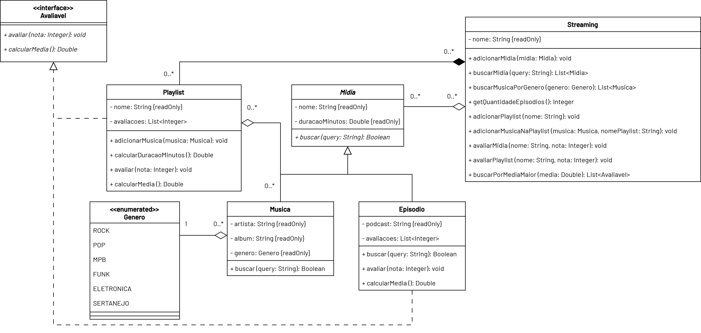
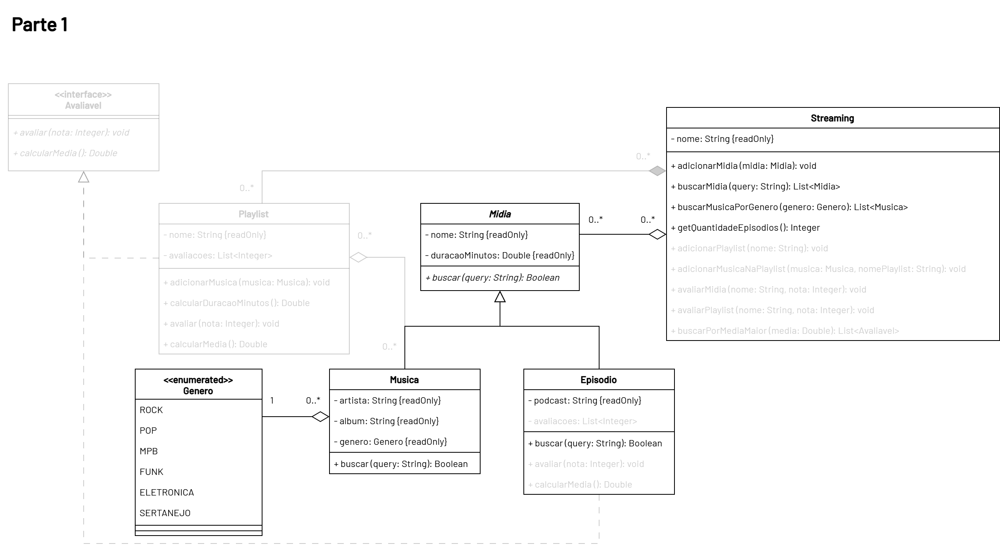
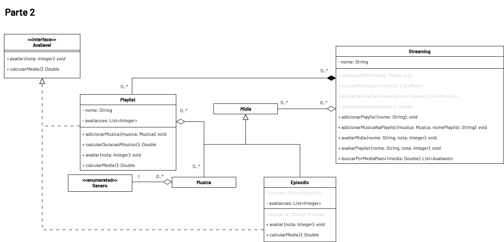

# Avaliação Continuada 03 - Prática 📎

## Orientações Gerais: 🚨

1. Utilize **apenas** tipos **wrapper** para criar atributos e métodos.
2. **Respeite** os nomes de atributos e métodos definidos no exercício.
3. Tome **cuidado** com os **argumentos** especificados no exercício.
   **Não** adicione argumentos não solicitados e mantenha a ordem definida no enunciado.
4. Verifique se **não** há **erros de compilação** no projeto antes de enviar.
5. As classes devem seguir as regras de encapsulamento.
6. Deixe um **construtor vazio** para utilização nos testes unitários.

## Orientações Adicionais ⚠️

1. A classe Main não será avaliada, portanto, você pode utilizá-la para fazer testes manuais.
2. A classe Main possui exemplos de código que podem te ajudar no desenvolvimento.
3. Caso encontre erros nos testes unitários, avise o proveiro e se for confirmado, o teste incorreto será desconsiderado para avaliação.

Boa sorte no desenvolvimento do sistema! 🍀🚀

## Case: Streaming 🎵

Olá caro desenvolvedor,

Você foi contratado para desenvolver um sistema que irá ajudar na gestão de uma plataforma de streaming de músicas.

Aqui está a especificação das classes do sistema:

Para facilitar o desenvolvimento, vamos dividir o trabalho em etapas:

## Parte 1 - Midia e Streaming 🎶 = ~52% dos pontos

### Enum `Genero`

Crie um enum chamado `Genero` com os seguintes valores:

- ROCK
- POP
- MPB
- FUNK
- ELETRONICA
- SERTANEJO

### Classe `Midia`

#### Construtor

* `Midia(String nome, Double duracaoMinutos)`
  * Inicializa os atributos `nome` e `duracaoMinutos`.

#### Métodos

* `Boolean buscar(String query)`
  * Método abstrato que retorna `true` ou `false` se a `query` for encontrada nos dados da mídia.

### Classe `Musica`

#### Construtor

* `Musica(String nome, Double duracaoMinutos, String artista, String album, Genero genero)`
  * Inicializa os atributos `nome`, `duracaoMinutos`, `artista`, `album` e `genero`.

#### Métodos

* `Boolean buscar(String query)`
  * Retorna `true` se a `query` estiver contida no `nome`, `artista`, `album` ou `genero` da música. Caso contrário, retorna `false`.
  * Não deve ser sensível a maiúsculas e minúsculas.
  * Exemplo: Se a música for "Bohemian Rhapsody" do artista "Queen" e o álbum "A Night at the Opera", a busca por "queen" ou "opera" deve retornar `true`.

### Classe `Episodio` (Episódio de Podcast)

#### Construtor

* `Episodio(String nome, Double duracaoMinutos, String podcast)`
  * Inicializa os atributos `nome`, `duracaoMinutos` e `podcast`.
  * `podcast` representa o nome do podcast ao qual o episódio pertence.

#### Métodos

* `Boolean buscar(String query)`
  * Retorna `true` se a `query` estiver contida no `nome` ou no `podcast` do episódio. Caso contrário, retorna `false`.
  * Não deve ser sensível a maiúsculas e minúsculas.
  * Exemplo: Se o episódio for "The Rise of AI" do podcast "Tech Talks", a busca por "tech" ou "AI" deve retornar `true`.

### Classe `Streaming`

#### Construtor

* `Streaming(String nome)`
  * Inicializa o atributo `nome`.
  * Inicializa a lista de mídias como vazia.

#### Métodos

* `void adicionarMidia(Midia midia)`
  * Adiciona a mídia fornecida à lista de mídias do streaming.
  * Nenhuma validação adicional é necessária!

* `List<Midia> buscarMidia(String query)`
  * Retorna uma lista de mídias que correspondem à `query` utilizando o método `buscar` de cada mídia.
  * A busca deve ser feita em todas as mídias armazenadas na lista.
  * Utilize o método `buscar` de cada mídia para verificar se a `query` corresponde a essa mídia.

* `List<Musica> buscarMusicasPorGenero(Genero genero)`
  * Retorna uma lista de músicas que correspondem ao `genero` fornecido.
  * A busca deve ser feita apenas entre as mídias que são instâncias da classe `Musica`.

* `Integer getQuantidadeEpisodios()`
  * Retorna a quantidade total de episódios armazenados na lista de mídias do streaming.
  * A contagem deve considerar apenas as mídias que são instâncias da classe `Episodio`.

## Parte 2 - Playlist e Avaliações 🎧 = ~48% dos pontos

### Interface `Avaliavel`

Define um contrato para objetos que podem ser avaliados.

#### Métodos

* `void avaliar(Integer nota)`
  * Método abstrato que adiciona uma avaliação (nota) ao objeto.

* `Double calcularMedia()`
  * Método abstrato que retorna a média das avaliações recebidas.

### Classe `Episodio` (Atualizada)

Atualize a classe `Episodio` para implementar a interface `Avaliavel`.

#### Atributos

* `List<Integer> avaliacoes` - Uma lista para armazenar as avaliações recebidas.

#### Construtor

Adicione a inicialização da lista de avaliações no construtor existente.

#### Métodos

* `void avaliar(Integer nota)`
  * Adiciona a `nota` à lista de avaliações.
  * A nota deve estar entre 0 e 10. Se a nota estiver fora desse intervalo, não deve ser adicionada.

* `Double calcularMedia()`
  * Retorna a média das avaliações recebidas.
  * Se não houver avaliações, deve retornar 0.0 para evitar divisão por zero.

### Classe `Playlist`

#### Construtor

* `Playlist(String nome)`
  * Inicializa o atributo `nome`.
  * Inicializa a lista de músicas com uma lista vazia.
  * Inicializa a lista de avaliações com uma lista vazia.

#### Métodos

* `void adicionarMusica(Musica musica)`
  * Adiciona a música fornecida à lista de músicas da playlist.
  * Nenhuma validação adicional é necessária!

* `Double calcularDuracaoMinutos()`
  * Retorna a soma das durações de todas as músicas na playlist.
  * A duração deve ser retornada em minutos.

* `void avaliar(Integer nota)`
  * Adiciona a `nota` à lista de avaliações da playlist.
  * A nota deve estar entre 0 e 10. Se a nota estiver fora desse intervalo, não deve ser adicionada.

* `Double calcularMedia()`
  * Retorna a média das avaliações recebidas pela playlist.
  * Se não houver avaliações, deve retornar 0.0 para evitar divisão por zero.

### Classe `Streaming` (Atualizada)

Atualize a classe `Streaming` para incluir métodos relacionados a playlists e avaliações.

### Atributos

* `List<Playlist> playlists` - Uma lista para armazenar as playlists criadas no streaming.

#### Construtor

Adicione a inicialização da lista de playlists no construtor existente.

#### Métodos

* `void adicionarPlaylist(String nome)`
  * Adiciona uma nova playlist com o nome fornecido à lista de playlists do streaming.
  * Deve criar uma nova instância de `Playlist` com o nome fornecido.
  * Nenhuma validação adicional é necessária!

* `void adicionarMusicaNaPlaylist(Musica musica, String nomePlaylist)`
  * Adiciona a música fornecida à playlist com o nome especificado.
  * Deve procurar a playlist pelo nome na lista de playlists e adicionar a música a essa playlist.
  * Se a playlist não for encontrada, nenhuma ação deve ser tomada.

* `void avaliarMidia(String nome, Integer nota)`
  * Avalia a mídia (episódio) com o nome fornecido, adicionando a `nota` correspondente.
  * Deve procurar a mídia pelo nome na lista de mídias e chamar o método `avaliar` da mídia encontrada.
  * Se a mídia não for encontrada ou não for avaliável, nenhuma ação deve ser tomada.

* `void avaliarPlaylist(String nome, Integer nota)`
  * Avalia a playlist com o nome fornecido, adicionando a `nota` correspondente.
  * Deve procurar a playlist pelo nome na lista de playlists e chamar o método `avaliar` da playlist encontrada.
  * Se a playlist não for encontrada, nenhuma ação deve ser tomada.

* `List<Avaliavel> buscarPorMediaMaior(Double media)`
  * Retorna uma lista de objetos que implementam a interface `Avaliavel` (episódios e playlists) cuja média de avaliações seja maior que o valor fornecido.
  * Deve verificar tanto as mídias quanto as playlists armazenadas no streaming.
  * Utilize o método `calcularMedia` para obter a média de cada objeto avaliável.
  * Primeiro adicione os episódios e depois as playlists na ordem em que aparecem nas listas do streaming.

You have reached the end of this jorney!\
Now go forth and code!

`[]~(￣▽￣)~*` ✨🌟💖💎🦄💎💖🌟✨🌟💖💎🦄💎💖🌟✨
