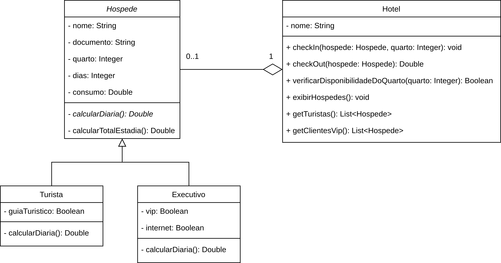

# Exercício - Hotelaria

## Orientações Gerais 🚨

1. Utilize **apenas** tipos **wrapper** para criar atributos e métodos.
2. **Respeite** os nomes de atributos e métodos definidos no exercício.
3. Tome **cuidado** com os **argumentos** especificados no exercício.
4. **Não adicione** argumentos não solicitados e mantenha a ordem definida no enunciado.
5. Verifique se **não há erros de compilação** no projeto antes de enviar.
6. As classes devem seguir as regras de **encapsulamento**.
7. Deixe um **construtor vazio** para utilização nos testes unitários.

## Diagrama de classes

## Classe `Hospede`:

**Getters e Setters**
- Deve conter **todos** os métodos getters e setters para todos os atributos.

### Métodos

**`calcularDiaria`**
- O método abstrato que calcula o valor da diária do hospede.

**`calcularTotalEstadia`**
- Calcula o total da estadia do hospede.
- O total da estadia é calculado multiplicando o valor da diária pelo número de dias da estadia mais o consumo do hospede.

## Classe `Turista`:

**Getters e Setters**
- Deve conter **todos** os métodos getters e setters para todos os atributos.

### Métodos

**`calcularDiaria`**
- Calcula o valor da diária do turista.
- O valor base da diária é de R$ 1500,00.
- Caso o turista opte por adicionar um guia, o valor da diária é acrescido de R$ 500,00.

## Classe `Executivo`

**Getters e Setters**
- Deve conter **todos** os métodos getters e setters para todos os atributos.

### Métodos

**`calcularDiaria`**
- Calcula o valor da diária do executivo.
- O valor base da diária é de R$ 2000,00.
- Caso o executivo opte por adicionar o acesso a área VIP do hotel para reuniões, o valor da diária é acrescido de R$ 1000,00.
- Caso o executivo opte por adicionar internet de alta velocidade para reuniões, o valor da diária é acrescido de R$ 500,00.

## Classe `Hotel`

**Getters**
- Deve conter apenas getters para todos os atributos.

### Métodos

**`checkIn`**
- Adiciona um hospede na lista de hospedes do hotel.
- O método deve receber um objeto do tipo `Hospede` e o número do quarto.
- O número do quarto deve ser um número inteiro positivo.
- Caso o número do quarto já esteja sendo utilizado por outro hóspede, não deve ser permitido o check-in.

**`checkOut`**
- Remove um hospede da lista de hóspedes do hotel.
- O método deve receber o hóspede que realizará o check-out.

**`verificarDisponibilidadeDoQuarto`**
- Verifica se o quarto está disponível.
- O método deve receber o número do quarto.
- Caso o quarto esteja disponível, o método deve retornar `true`, caso contrário, deve retornar `false`.

**`exibirHospedes`**
- Exibe todos os hóspedes atuais do hotel.

**`getTuristas`**
- Retorna uma lista com todos os turistas que estão atualmente hospedados no hotel.

**`getClientesVip`**
- Retorna uma lista com todos os executivos e que optaram pelo acesso ao espaço VIP, que estão atualmente hospedados no hotel.
