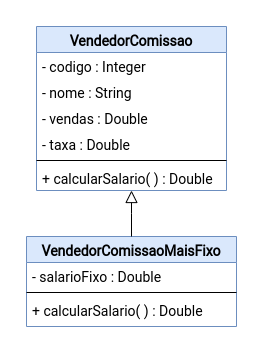

# Exercício - Herança 📎

## Orientações Gerais: 🚨
1. Utilize **apenas** tipos **wrapper** para criar atributos e métodos.
2. **Respeite** os nomes de atributos e métodos definidos no exercício.
3. Tome **cuidado** com os **argumentos** especificados no exercício.
   **Não** adicione argumentos não solicitados e mantenha a ordem definida no enunciado.
4. Verifique se **não** há **erros de compilação** no projeto antes de enviar.
5. As classes devem seguir as regras de encapsulamento.
6. Deixe um **construtor vazio** para utilização nos testes unitários.

## Exercício - Vendedor 🚩

Implemente o seguinte diagrama de classes:

**Observação:** considere 0,05 = 5%, 0,1 = 10% para o valor da taxa

Métodos da classe `VendedorComissao`:

* calcularSalario:
  * calcula o salário do vendedor conforme os atributos **vendas** e **taxa**.
  * **vendas** é o total vendido, e **taxa** é comissão em cima das vendas.

Métodos da classe `VendedorComissaoMaisFixo`:

* calcularSalario:
    * calcula o salário do vendedor conforme os atributos **vendas**, **taxa** e **salarioFixo**

