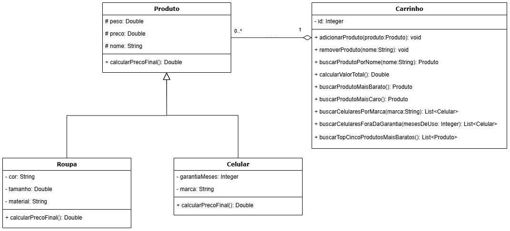

# Exercício - Carrinho de Compras 🛒

## Orientações Gerais 🚨

1. Utilize **apenas** tipos **wrapper** para criar atributos e métodos.
2. **Respeite** os nomes de atributos e métodos definidos no exercício.
3. Tome **cuidado** com os **argumentos** especificados no exercício.
4. **Não adicione** argumentos não solicitados e mantenha a ordem definida no enunciado.
5. Verifique se **não há erros de compilação** no projeto antes de enviar.
6. As classes devem seguir as regras de **encapsulamento**.
7. Deixe um **construtor vazio** para utilização nos testes unitários.

---

## Diagrama de classe

## Classe: `Produto` 🪴

- Deve conter **todos** os métodos getters e setters para os atributos da classe `preco`, `nome` e `peso`.
- Deve conter o método `toString()`

### Métodos Públicos

- `public Double calcularPrecoFinal()`
  - Retorna o preço final do produto.

## Classe: `Roupa` 👚

- Deve conter **todos** os métodos getters e setters para os atributos da classe `tamanho`, `cor` e `material`.
- Deve conter o método `toString()`

### Métodos Públicos

- `public Double calcularPrecoFinal()`
  - Calcula o preço final da roupa, aplicando um desconto de 15% para roupas de material de "**couro**".

## Classe: `Celular` 📱

- Deve conter **todos** os métodos getters e setters para os atributos `garantiaMeses` e `marca`.
- Deve conter o método `toString()`

### Métodos Públicos

- `public Double calcularPrecoFinal()`
  - Calcula o preço final do celular, somando 50 reais para cada mês de garantia ao preço final.

---

## Classe: `Carrinho` 🛒

- Deve conter **todos** os métodos getters e setters para os atributos da classe.

### Métodos Públicos

- `public void adicionarProduto(Produto produto)`
  - Adiciona um produto válido ao carrinho. Caso o produto seja inválido (preço nulo ou menor que zero, nome nulo ou com espaços vazios), não faz nada.

- `public void removerProduto(String nome)`
  - Remove todos os produtos encontrados do carrinho pesquisando por um nome. Caso o produto não esteja presente, não faz nada.
  - Certifique-se de remover mesmo com dois produtos com mesmo nome na sequência. (Utilize o main para testar)

- `public Produto buscarProdutoPorNome(String nome)`
  - Retorna o produto com o nome especificado. Se o produto não for encontrado, retorna `null`.

- `public Double calcularValorTotal()`
  - Calcula o valor total de todos os produtos no carrinho. Retorna a soma do preço de todos os produtos.

- `public List<Celular> buscarCelularesPorMarca(String marca)`
  - Retorna uma lista de celulares do carrinho com a marca especificada. Filtra os produtos do tipo `Celular` e compara a marca do celular com a marca passada como parâmetro.

- `public List<Celular> buscarCelularesForaDaGarantia(Integer mesesDeUso)`
  - Retorna os celulares do carrinho que estão fora da garantia, onde o tempo de uso é maior que a garantia. 

- `public Produto buscarProdutoMaisBarato()`
  - Retorna o produto mais barato do carrinho. Caso o carrinho esteja vazio, retorna `null`.

- `public Produto buscarProdutoMaisCaro()`
  - Retorna o produto mais caro do carrinho. Caso o carrinho esteja vazio, retorna `null`.

---

### Desafio ⚡

- `public List<Produto> buscarTopCincoProdutosMaisBaratos()`
  - Retorna os 5 produtos mais baratos do carrinho, ordenados de acordo com o preço.

---

## Observações

- **Crie um método main dentro da classe Main para testar o funcionamento dos métodos**
