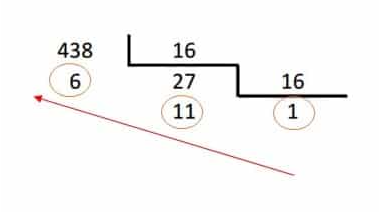

# Exercícios de Lógica 📎

## Orientações Gerais: 🚨

1. Utilize **apenas** tipos **wrapper** para criar variáveis.
2. Verifique se **não** há **erros de compilação** no projeto antes de enviar.

---

### 🌀 Exercício 1 - Sequência Fibonacci

Escreva um programa que leia um número e retorne em array a sequência de Fibonacci
até o número lido.

| Entrada | Saída                              |
|---------|------------------------------------|
| 3       | [1, 1, 2]                          |
| 10      | [1, 1, 2, 3, 5, 8, 13, 21, 34, 55] |
| 7       | [1, 1, 2, 3, 5, 8, 13]             |

---

### 🧩 Exercício 2 - Prefixo comum mais longo (Leetcode longest-common-prefix)

> fonte: https://leetcode.com/problems/longest-common-prefix/description/

Escreva um método para encontrar o **prefixo comum mais longo** entre um **array de strings**.

Se **não houver nenhum prefixo comum**, retorne uma **string vazia** `""`.

**Exemplo 1:**

Entrada:
`strs = ["flower", "flow", "flight"]`
Saída:
`"fl"`

**Exemplo 2:**

Entrada:
`strs = ["dog", "racecar", "car"]`
Saída:
`""`
**Explicação:** Não há nenhum prefixo comum entre as strings fornecidas.

---

### 🧮 Exercício 3 - Converter para Hexadecimal (Bee 1957)

> fonte: https://judge.beecrowd.com/en/problems/view/1957

Os dados armazenados em computadores estão em binário. Uma forma econômica de visualizar esses
números é utilizando a base 16 (hexadecimal).

Sua tarefa é escrever um programa que, dado um número natural em base 10, mostre sua representação
em hexadecimal (Sem utilizar soluções prontas do Java).

#### Entrada

A entrada é um número inteiro positivo na base 10.

#### Saída

A saída deve ser o mesmo número em base 16 em uma única linha, conforme mostrado nos exemplos.

| Entrada | Saída |
|---------|-------|
| 10      | A     |
| 15      | F     |
| 16      | 10    |
| 31      | 1F    |
| 65535   | FFFF  |

#### Lógica da conversão 🧠

Para converter um número decimal para hexadecimal, você pode usar o seguinte algoritmo:

1. Divida o número por 16.
2. Anote o quociente e o resto.
3. Repita o processo com o quociente até que ele seja 0.
4. Os restos anotados formam o número hexadecimal, começando do último resto anotado até o primeiro.
5. Converta os restos para seus equivalentes hexadecimais, seguindo a seguinte tabela:

| Decimal | Hexadecimal |
|---------|-------------|
| 0       | 0           |
| 1       | 1           |
| 2       | 2           |
| 3       | 3           |
| 4       | 4           |
| 5       | 5           |
| 6       | 6           |
| 7       | 7           |
| 8       | 8           |
| 9       | 9           |
| 10      | A           |
| 11      | B           |
| 12      | C           |
| 13      | D           |
| 14      | E           |
| 15      | F           |

##### Exemplo:

Vamos realizar a conversão do número 438:

Primeiro divimos ele por 16 até que o quociente seja 0:

O resultado das divisões nos deu os restos: 1, 11, 6 (na ordem inversa).
Agora, vamos converter os restos para hexadecimal:

- 1 (decimal) = 1 (hexadecimal)
- 11 (decimal) = B (hexadecimal)
- 6 (decimal) = 6 (hexadecimal)

Dessa forma, o número 438 em hexadecimal é 1B6.

---

### 💪🔥 Desafio (nível hard) - Matriz transposta (Leetcode transpose-matrix)

> fonte: https://leetcode.com/problems/transpose-matrix/description/

Dado um array bidimensional (matriz) de inteiros, retorne a transposta da matriz.

A transposta de uma matriz é a matriz obtida ao inverter a matriz sobre sua diagonal principal,
trocando os índices das linhas e colunas.

**Exemplo 1:**

Entrada:
`matrix = [[1,2,3],[4,5,6],[7,8,9]]`
Saída:
`[[1,4,7],[2,5,8],[3,6,9]]`

**Exemplo 2:**

Entrada:
`matrix = [[1,2,3],[4,5,6]]`
Saída:
`[[1,4],[2,5],[3,6]]`
